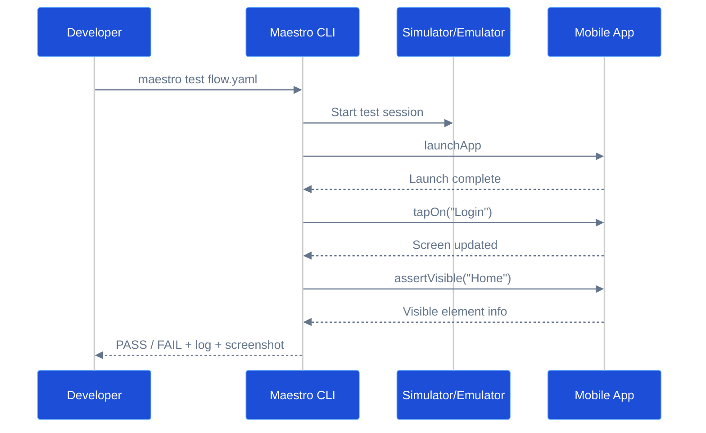
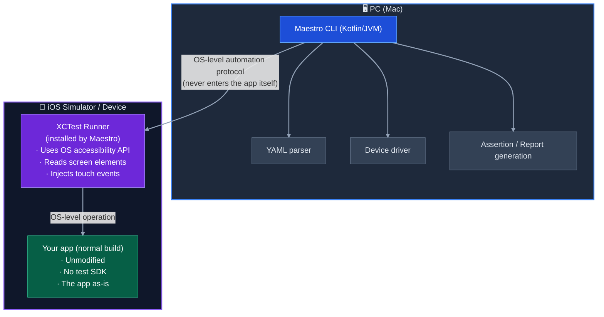
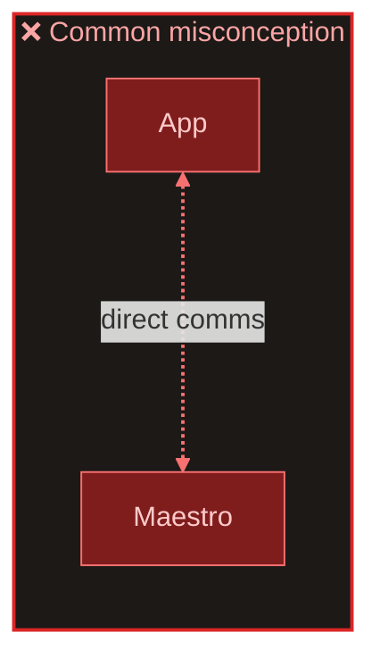
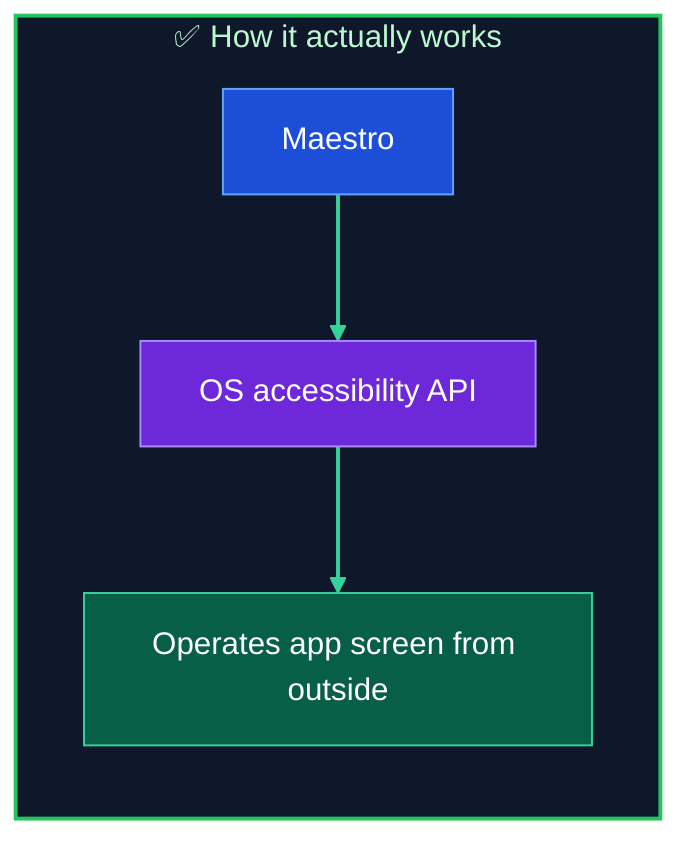

# Maestro Beginner Guide

This document is a quick-start guide for **Maestro**, a mobile UI automation test tool.  
It covers the basics that work with Flutter, iOS Simulator, and Android Emulator.

## 🎯 What is Maestro

Maestro is an **E2E test tool** that launches your app, interacts with the screen,  
and verifies that things are visible, tappable, and navigable.

Key features:

- Write scenarios in YAML (low learning cost)
- Human-readable commands like `tapOn` and `assertVisible`
- Runs on both iOS / Android devices and simulators
- Produces debug artifacts (screenshots, logs)

## ✨ Why it's useful

- Mechanically verify that screens actually work before a release
- Reduce repetitive manual testing
- Quickly detect regressions when specs change

## Minimal example

```yaml
appId: com.example.myApp
---
- launchApp
- tapOn: 'Login'
- assertVisible: 'Home'
```

These 3 lines handle "launch → tap → verify screen".

## 📊 Sequence diagram



## 🔄 Typical workflow

1. Get the app into a runnable state (`flutter run`, etc.)
2. Write Maestro flows (`.maestro/*.yaml`)
3. Run `maestro test <flow>`
4. On failure, adjust selectors using `maestro hierarchy` and screenshots
5. Once stable, add to CI

## 🛠 Common commands

```bash
# List connectable local devices
maestro list-devices
```

```bash
# Run a flow
maestro test .maestro/sample.yaml
```

```bash
# Inspect the accessibility hierarchy of the current screen
maestro hierarchy
```

## 💡 Selector design tips

- Start with `tapOn: 'visible text'`
- If unstable, explicitly set an accessibility label (`Semantics`) on the app side
- Coordinate taps are a last resort (prone to breaking on different screen sizes or with the keyboard open)

For Flutter, attaching Semantics to the target widget tends to stabilize things.

## 🔍 How to read failures

When `maestro test` fails, it shows a debug directory.  
Looking at `screenshot-*.png` and `maestro.log` inside usually identifies the cause.

Order of inspection:

1. Screenshot (are we on the expected screen?)
2. Hierarchy (do element names match?)
3. Flow (is the tap order and assert target correct?)

## ⚠️ Common pitfalls

- `appId` doesn't match the actual bundle id / applicationId
- Keyboard is open and hiding the element
- Displayed text doesn't match the accessibility label
- The same selector doesn't work identically on iOS and Android

## 📖 First learning steps

1. Create a flow for just one screen (launch → 1 tap → 1 assert)
2. Add one screen transition
3. Add an input form (including keyboard-dismiss handling)
4. Also write a failure case (invalid input, etc.)

---


## ⚖️ Comparison with Appium (Flutter perspective)

Appium is the industry standard for mobile automation, but it has a fundamental compatibility issue with **Flutter apps**.

### Core problem: Flutter × Appium

Flutter uses its own rendering engine (Skia / Impeller), so it **has no native View hierarchy**.  
Appium operates on the native UI tree (`AccessibilityNodeInfo` on Android / `XCUIElement` on iOS), which causes a fundamental mismatch.

| Issue | Details |
| --- | --- |
| **Elements not visible** | Flutter widgets are not native Views, so they may not appear in the Appium inspector |
| **Semantics dependency** | Flutter must explicitly add fine-grained `Semantics` / `semanticsLabel` for Appium to interact |
| **appium-flutter-driver required** | The standard UiAutomator2 / XCUITest drivers don't work; a dedicated driver is needed |
| **Driver maturity** | `appium-flutter-driver` is community-driven and less stable than native drivers |
| **Complex context switching** | Mixed Flutter and native screens (WebView, platform channel) require context switching |
| **Heavy setup** | JDK + Appium Server + appium-flutter-driver + Flutter test profile build required |

### Why Maestro suits Flutter

Maestro operates on **what is actually displayed on screen** (text, accessibility labels) rather than the native View hierarchy.  
This makes it resilient to Flutter's rendering approach.

| Aspect | Maestro | Appium |
| --- | --- | --- |
| **Flutter support** | No extra driver needed. Works out of the box | Requires `appium-flutter-driver` |
| **Element targeting** | Displayed text / `Semantics` label — direct tap | Depends on native View tree. Elements may be invisible in Flutter |
| **Syntax** | YAML (declarative, concise) | Java/Python code (procedural) |
| **Setup** | Single `curl` install | JDK + Appium Server + driver config |
| **Wait handling** | Automatic (built-in retry) | Manual `WebDriverWait` etc. required |
| **Stability** | Auto-waits for UI. Less flaky | Manual timing needed. Especially unstable with Flutter |
| **Speed** | Fast — communicates directly with device | Slower — goes through an intermediate server |
| **Learning cost** | Start if you can read YAML | Programming + Selenium API + Flutter driver knowledge needed |

### Which to choose

- **Maestro is better for**: Flutter app E2E tests in general, smoke tests, basic flow verification, small teams, fast E2E adoption
- **Appium is better for**: Existing large Appium assets, mixed Flutter + native apps under the same framework, complex test logic (branching, data-driven)

> **Conclusion**: For Flutter apps, Maestro is overwhelmingly easier to set up and more stable.
> Appium is the "industry standard that doesn't play well with Flutter" — for Flutter projects, evaluate Maestro first.

---

## 🏗 Maestro internal architecture

Maestro is a **black-box** E2E test tool.  
Its defining feature is that **nothing is embedded into the app under test**.

### Overall structure



### How it communicates with iOS / Android

| Environment | Communication method |
| --- | --- |
| **iOS Simulator** | Inter-process communication on Mac (same machine) |
| **iOS device** | Via USB (Apple developer protocol / idb) |
| **Android Emulator** | Via ADB (Android Debug Bridge) |

Communication flow:

1. **Maestro CLI** starts on `maestro test`
2. For iOS, it installs and launches **XCTest Runner** on the device
3. XCTest Runner reads the element tree (accessibility info) using **Apple's official XCUITest framework**
4. Maestro CLI and XCTest Runner exchange commands to perform taps, swipes, and text input

### The app itself doesn't communicate — what "black-box" means

Common question: "Isn't it a problem if the built app communicates with a test tool?"

**Answer: The app itself communicates with nothing.** This is the key design point of Maestro.





- The app is **a normally built, unmodified app**
- **Zero** test SDKs or libraries need to be embedded
- **Zero** network communication code needs to be added to the app
- The **exact same binary** submitted to the App Store can be tested

#### Why is this possible

The OS (iOS / Android) has built-in **accessibility APIs** for screen readers (VoiceOver / TalkBack).  
These APIs expose element information on-screen for external use.

Maestro uses this mechanism to:

- Read "what is displayed" on screen (`assertVisible`)
- Inject touch events at the OS level (`tapOn`)

In other words, it operates **at the same level as a human tapping the screen with a finger**.

#### Comparison with instrumented testing

| Aspect | Maestro (black-box) | Flutter integration_test (white-box) |
| --- | --- | --- |
| **App modification** | Not required | Requires a special test build |
| **Test SDK** | Not required | Embeds `flutter_test` in the app |
| **Test target** | Same binary as production | Test-only binary |
| **App Store submission** | The tested app can be submitted as-is | Requires rebuilding after removing test code |

> **Conclusion**: Maestro operates from the "outside" of the app using the OS-provided accessibility API.
> No test code, SDK, or communication functionality is added to the app — safe for App Store review and security.

---

## 🧪 Practical guide: Design principles (using ex1B / ex2 / ex2A / ex3)

Using the four exercise apps in this repository, we explain practical Maestro flow design principles.

### Exercise app overview

| App | Theme | Flow | Main test targets |
| --- | --- | --- | --- |
| **ex1B** | Keyboard input form | `keyboard_form.yaml` | English / Japanese / Email input, conversion, submit |
| **ex2** | Controls lab | `control_lab.yaml` | Dropdown, checkbox, switch, slider, chip |
| **ex2A** | Dual list lab | `complex_lists.yaml` | Parent-child list selection, filter, sort, modal edit |
| **ex3** | India History Explorer | `history_explorer.yaml` / `signup_success.yaml` / `auth_fail_close.yaml` | Auth flow, navigation, sort, logout |

### Runtime videos (iOS Simulator)

**ex1B — Keyboard input form**

<video src="https://github.com/suzuki-taka-bls/maestro-sandbox/raw/main/maestro/ex1B/artifacts/ex1B_runtime_ios.mp4" controls></video>

**ex2 — Controls lab**

<video src="https://github.com/suzuki-taka-bls/maestro-sandbox/raw/main/maestro/ex2/artifacts/ex2_runtime_ios.mp4" controls></video>

**ex2A — Dual list lab**

<video src="https://github.com/suzuki-taka-bls/maestro-sandbox/raw/main/maestro/ex2A/artifacts/ex2A_runtime_ios.mp4" controls></video>

**ex3 — India History Explorer**

<video src="https://github.com/suzuki-taka-bls/maestro-sandbox/raw/main/maestro/ex3/artifacts/ex3_runtime_ios.mp4" controls></video>

### Principle 1: Design Semantics labels as "test IDs"

In Flutter, `Semantics` widgets are directly linked to Maestro selectors.  
For elements that can't be uniquely identified by displayed text alone, **explicitly set a `Semantics` `label` on the Dart side**.

```dart
// ex2/lib/main.dart — Add a Semantics label to a button
Semantics(
  button: true,
  label: 'Apply settings button',   // ← Can be targeted with tapOn in Maestro
  child: FilledButton(
    onPressed: _applySettings,
    child: const Text('Apply settings'),
  ),
),
```

```yaml
# ex2/.maestro/control_lab.yaml — Tap by label
- tapOn: 'Apply settings button'
```

**Naming convention tips:**

| Pattern | Example (Dart side) | Example (YAML side) |
| --- | --- | --- |
| Button | `label: 'Sign in button'` | `tapOn: 'Sign in button'` |
| Text input | `label: 'Username input'` | `tapOn: 'Username input'` |
| List item | `label: 'board:Mughal Empire Board'` | `tapOn: 'board:Mughal Empire Board'` |
| Toggle | `label: 'Enable reminders switch'` | `tapOn: 'Enable reminders switch'` |

> In ex2A, uniqueness is ensured with **prefix + dynamic value** like `board:${board.name}` / `item:${item.title}`.

### Principle 2: Use status text to verify results

Each app has a `_status` variable that displays operation results as `Status: ○○` text on screen.  
Using this as the `assertVisible` target lets you **reliably verify internal state changes**.

```dart
// ex2A/lib/main.dart — Update status text on each action
setState(() {
  _selectedBoardId = board.id;
  _status = 'Status: selected ${board.name}';
});
```

```yaml
# ex2A/.maestro/complex_lists.yaml — Verify with status text
- tapOn: 'board:Mughal Empire Board'
- assertVisible: 'Status: selected Mughal Empire Board'
```

> This pattern is common across all apps. Using **status text** as the `assertVisible` target confirms not just visual changes but also the correctness of the logic.

### Principle 3: Write keyboard-dismiss handling defensively

The "Done" button label differs between iOS and Android (`完了` / `done`).  
ex1B and ex3 use `runFlow` + `when: visible` to handle both.

```yaml
# ex1B/.maestro/keyboard_form.yaml — Handles both iOS and Android
- runFlow:
    when:
      visible: done
    commands:
      - tapOn: done
- runFlow:
    when:
      visible: 完了
    commands:
      - tapOn: 完了
```

> **Design point**: `when: visible` is a conditional execution — if the button isn't present, it's skipped.
> This lets a single YAML file handle both iOS and Android.

### Principle 4: Provide multiple flows per app to separate happy path and failure cases

ex3 has 3 flow files, each covering a different scenario.

| Flow | Scenario | Verification |
| --- | --- | --- |
| `history_explorer.yaml` | Normal sign-in → list → detail → sort → logout | Full navigation of the main flow |
| `signup_success.yaml` | Successful sign-up | New user registration |
| `auth_fail_close.yaml` | Wrong password → app closes | Failure case behavior (auth failure) |

```yaml
# ex3/.maestro/auth_fail_close.yaml — Failure case test
- inputText: 'wrong-password'
- tapOn: 'Sign in button'
- assertNotVisible: 'Mock Sign In / Sign Up'   # Confirm the app closed
```

> **Design point**: Mixing failure cases into happy-path flows makes them long and harder to diagnose.
> Splitting by scenario also makes parallel execution in CI easier.

### Principle 5: Coordinate taps are a last resort

ex2 has one instance of a coordinate tap with `point: '47%,42%'`.

```yaml
# ex2/.maestro/control_lab.yaml — Coordinate tap (anti-pattern)
- tapOn:
    point: '47%,42%'
```

This is a workaround for cases like dropdown options where Semantics labels can't reliably target the element.  
However, it **breaks easily with different screen sizes, resolutions, or keyboard visibility**, so avoid it where possible.

Priority for alternatives:

1. **`tapOn` with displayed text** — most stable
2. **`tapOn` with `Semantics` label** — when text is duplicated
3. **`scrollUntilVisible` + text** — when scrolling is needed
4. **Coordinate tap** — only when all other options are exhausted

### Principle 6: Use assertVisible / assertNotVisible appropriately

| Command | Use case | Example |
| --- | --- | --- |
| `assertVisible` | Confirm an element is on screen | `assertVisible: 'Welcome, Sora'` |
| `assertNotVisible` | Confirm an element disappeared / was hidden by filter | `assertNotVisible: 'Grand Trunk Road map'` (when done filter is OFF) |

ex2A verifies that **list items toggle show/hide when the filter is turned on/off**.

```yaml
# ex2A/.maestro/complex_lists.yaml — Filter verification
- tapOn: 'Show done'
- assertNotVisible: 'Grand Trunk Road map'    # Filter OFF → done item disappears
- tapOn: 'Show done'
- assertVisible: 'item:Grand Trunk Road map'  # Filter ON → reappears
```

### ✅ Summary: Design principles checklist

1. Are `Semantics` labels attached to all interaction targets?
2. Do dynamic list items have unique labels with a `prefix:value` pattern?
3. Are operation results verified with status text (`Status: ○○`)?
4. Does keyboard-dismiss handling support both iOS and Android?
5. Are happy-path and failure-case flows in separate files?
6. Are coordinate taps avoided (or is an alternative being considered)?

---

## 🔗 External links

### Maestro

- [Maestro official site](https://maestro.mobile.dev/) — Home page and installation instructions
- [Maestro command reference](https://maestro.mobile.dev/api-reference/commands) — All commands including tapOn / assertVisible
- [Maestro Flutter support](https://maestro.mobile.dev/platform-support/flutter) — Flutter-specific notes

### Flutter

- [Semantics class (Flutter API)](https://api.flutter.dev/flutter/widgets/Semantics-class.html) — The widget underpinning Maestro selectors
- [Flutter accessibility guide](https://docs.flutter.dev/accessibility-and-internationalization/accessibility) — Official guide to Semantics design
- [Flutter integration_test](https://docs.flutter.dev/testing/integration-tests) — White-box testing, different from Maestro

### XCUITest (for first-timers)

- [A Step-by-Step Guide to XCUITest Framework (HeadSpin)](https://www.headspin.io/blog/a-step-by-step-guide-to-xcuitest-framework) — Explains XCUIApplication / XCUIElement / XCUIElementQuery from scratch. Ideal for beginners
- [Getting Started with XCUITest (Sauce Labs)](https://saucelabs.com/resources/blog/getting-started-with-xcuitest) — Compact overview. Good for a quick high-level view
- [XCTest — Apple Developer Documentation](https://developer.apple.com/documentation/xctest) — Apple official reference

### Appium (for first-timers)

- [Intro to Appium — official docs](https://appium.io/docs/en/2.0/intro/) — Explains Appium's design philosophy (W3C WebDriver, client-server, driver/plugin architecture)
- [Appium Quickstart (official v3.2)](https://appium.io/docs/en/3.2/quickstart/) — 4-step guide from install to first test run
- [Appium Tutorial for Beginners (BrowserStack)](https://www.browserstack.com/guide/appium-tutorial-for-testing) — Intro to Appium testing on real device cloud
- [appium-flutter-driver (GitHub)](https://github.com/nicolgit/appium-flutter-driver) — Dedicated driver required when using Flutter × Appium
